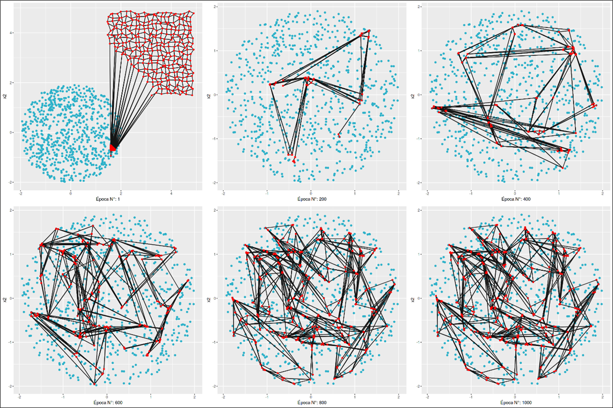
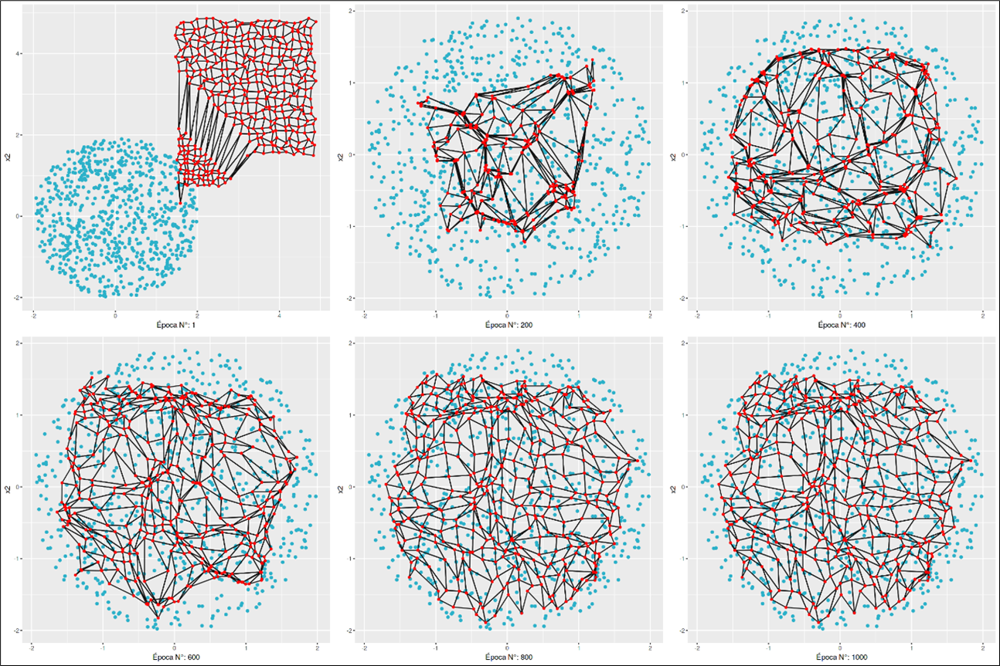
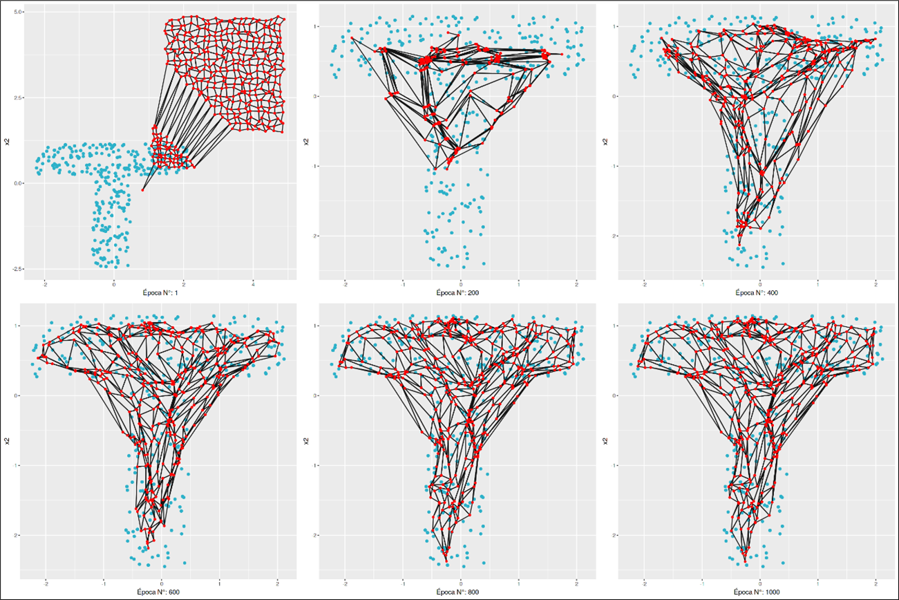
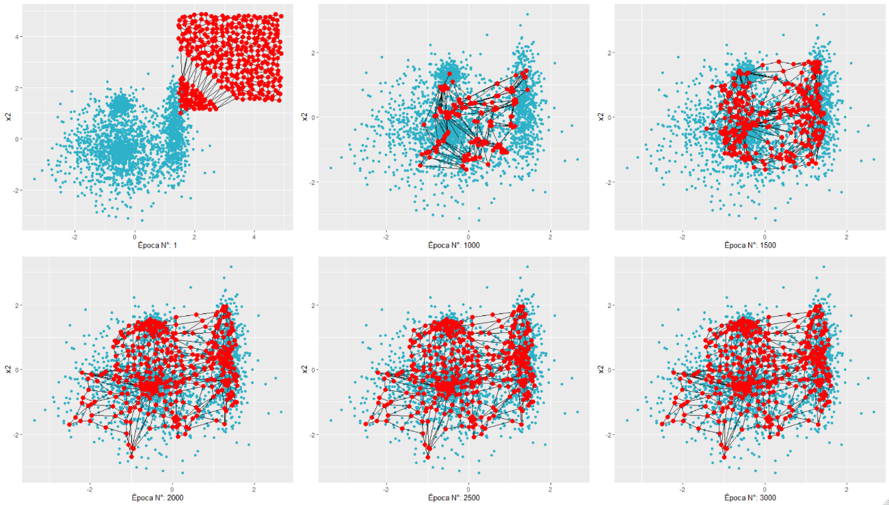
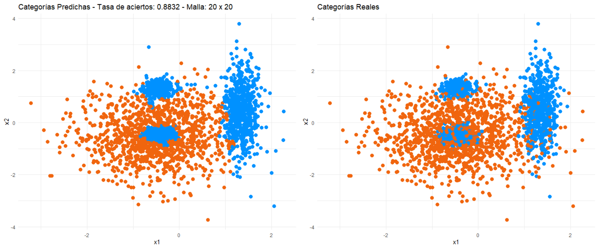

# Algoritmo de mapas auto-organizados de Kohonen (SOM)

Se desarrolla un algoritmo basado en redes SOM y se evalúa su funcionamiento. 

La función SOM diseñada cuenta con los siguientes parámetros:
- train: datos de entrenamiento.
- n: cantidad de neuronas en el eje x.
- m: cantidad de neuronas en el eje y.
- numEpocasGrueso: número de épocas en la etapa de ordenamiento topológico.
- numEpocasMedio: número de épocas en la etapa de transición.
- numEpocasFino: número de épocas en la etapa ajuste fino.
- tasaAprendizajeGrueso: tasa de aprendizaje en la etapa de ordenamiento topológico.
- tasaAprendizajeMedio: tasa de aprendizaje en la etapa de transición.
- tasaAprendizajeFino: tasa de aprendizaje en la etapa de ajuste fino.
- sleep: tiempo en segundos que se pausa el algoritmo para graficar.
- saltoGrafico: cada cuanta época se grafica.
- seed: semilla.

El algoritmo está configurado por defecto para que el alcance de la vecindad se reduzca linealmente desde la etapa de ordenamiento gruesa hasta 0 (etapa de ajuste fino). 

## Experimentos:

Se define una malla de 20 x 20 neuronas sobre la base concentile.csv
Se observa que en la primera etapa de ordenamiento grueso con una tasa de aprendizaje alta se produce un gran desorden en el movimiento de las neuronas y se puede ver como en la última época de entrenamiento la forma de la malla queda desfigurada. No obstante, la red SOM consiguió rodear una buena parte del conjunto de datos, es decir, se adaptó con bastante solvencia a la distribución de las observaciones.

Se prueba una malla de 20 neuronas por 20 neuronas manteniendo los parámetros del experimento anterior salvo la tasa de aprendizaje gruesa que se reduce a 0.3 con el objetivo de generar menos desorden en el movimiento de las neuronas de la red en la etapa inicial. Se puede ver como al final de la corrida la malla logró mantener una forma de grilla adaptada a los datos, aunque no llegó a cubrir bien la zona exterior del circulo.
 

Se ajusta la red SOM a los datos del dataset te.csv con una tasa de aprendizaje gruesa de 0.3 y se observa una convergencia adecuada de la red al final del ajuste.

# Clasificación no supervisada mediante SOM

Se utilizan redes SOM (aprendizaje no supervisado) para clasificar el conjunto de datos "clouds.csv". 

Se configura una malla de 20 x 20 y se inicia el algoritmo con una tasa de aprendizaje gruesa igual a 0.3.

Se logra una tasa de aciertos del 88,32 % con el método propuesto.

 
